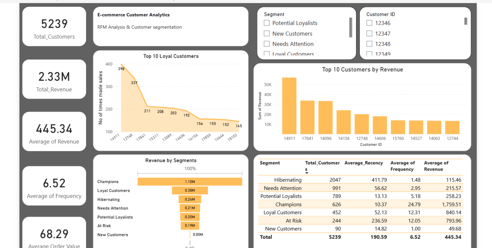

#  E-commerce Customer Analytics  

##  Business Problem  
The client, an e-commerce business, faced challenges in understanding customer behavior and maximizing revenue opportunities. Specifically:  
- Limited visibility into **who their best customers are** and how to retain them.  
- Missed opportunities for **cross-sell and up-sell** due to lack of product association analysis.  
- High marketing spend without clarity on **ROI or target segmentation**.  
- Difficulty in tracking KPIs such as **Average Order Value (AOV), Customer Lifetime Value (CLV), Retention, and Churn**.  

The objective was to build a **data-driven analytics framework** that could uncover patterns, segment customers, and provide actionable insights for strategy.  

---

## Structured Approach  

### 1. Data Understanding & Cleaning  
- Explored transactional data containing customer purchases, product categories, and timestamps.  
- Handled missing values, duplicates, and outliers.  
- Converted date columns for **time-based cohort analysis**.  
- Standardized product categories for consistent aggregation.  

### 2. Exploratory Data Analysis (EDA)  
- Analyzed **monthly sales trends** to identify peak seasons.  
- Investigated **customer purchasing frequency** and **average spend distribution**.  
- Segmented products into **high, medium, and low-performing categories**.  

### 3. Market Basket Analysis (Apriori Algorithm)  
- Used association rule mining to identify frequently bought product combinations.  
- Generated rules such as `{Laptop} → {Mouse}` with high confidence and lift.  
- Derived **cross-sell bundles** to increase basket size and revenue per transaction.  

### 4. RFM Segmentation  
- Defined customer segments using:  
  - **Recency (R):** How recently a customer purchased.  
  - **Frequency (F):** How often they purchase.  
  - **Monetary Value (M):** How much they spend.  
- Segmented into groups like:  
  - **Champions:** Loyal high-value customers.  
  - **At-Risk:** Customers who haven’t purchased recently.  
  - **Hibernating:** Inactive customers.  
- Provided a **playbook of engagement strategies** per segment.  

### 5. Dashboard Development  
- Designed a **Power BI dashboard** to visualize KPIs and segment performance.  
- Key metrics included:  
  - Revenue by month and category.  
  - Customer retention rate.  
  - RFM segment distribution.  
  - Top cross-sell product bundles.  

---

##  Recommendations  

1. **Customer Retention & Loyalty**  
   - Offer exclusive rewards to **Champions** to increase lifetime value.  
   - Create **personalized re-engagement campaigns** for At-Risk customers.  

2. **Cross-Sell & Up-Sell**  
   - Launch bundled offers for frequently bought products.  
   - Highlight “People also bought” suggestions during checkout.  

3. **Marketing Optimization**  
   - Use RFM segments to **target campaigns with precision**.  
   - Allocate budget to **high ROI segments** rather than blanket campaigns.  

4. **Product Strategy**  
   - Expand product lines in **high-demand categories**.  
   - Phase out or discount **low-performing SKUs**.  

---

##  Business Impact  

- **Revenue Uplift:** Cross-sell bundles projected a **10–15% increase in basket value**.  
- **Reduced Churn:** Targeted campaigns could cut churn by **5–8%**.  
- **Marketing ROI:** Segmentation improved ROI by **2–3x** compared to generic campaigns.  
- **Customer Retention:** Increased loyalty program effectiveness by **10%+**.

---  


## Tech Stack & Libraries  

- **Cloud Platform:** Microsoft Azure (Blob Storage, Azure Machine Learning)  
- **Version Control:** Git & GitHub  
- **Language:** Python  
- **Key Libraries:** pandas, mlxtend, matplotlib  
- **Dashboarding:** Power BI

---


##  Project Structure

The repository is structured with modular notebooks for each phase of the analysis:

```
├── assets/
│   └── dashboard_preview.png
├── data/
│   ├── cleaned_online_retail.csv
│   └── online_retail.csv
├── notebooks/
│   ├── 01_Data_Cleaning_and_EDA.ipynb
│   ├── 02_Market_Basket_Analysis(Custom).ipynb
│   ├── 03_Market_Basket_Analysis(UK).ipynb
│   └── 04_Customer_Analytics_and_Segmentation.ipynb
├── .gitignore
├── requirements.txt
└── README.md
```

---

##  How to Run the Project

1.  **Clone the Repository:**
    ```bash
    git clone [https://github.com/santhanakrishnan2002/ecommerce-customer-analytics.git](https://github.com/santhanakrishnan2002/ecommerce-customer-analytics.git)
    ```
2.  **Install Dependencies:**
    ```bash
    pip install -r requirements.txt
    ```
3.  **Run the Notebooks:**
    Execute the Jupyter Notebooks in the `notebooks/` directory in numerical order.

4.  **View the Dashboard:**
    The final insights are consolidated in a Power BI dashboard connected to the `rfm_customer_segments.csv` output file.
---

## Interactive Dashboard

The final insights from the RFM analysis and core e-commerce metrics are consolidated into an interactive Power BI dashboard.

### [View the Interactive Dashboard Here](https://app.powerbi.com/view?r=eyJrIjoiNjNiYWE5YTItMWE5YS00NWY2LTk0MTYtMmY0NjQxNjNmNzZjIiwidCI6ImVhOGFhNDU2LThhMjUtNGNjMy1iZmVlLTAzN2Q4OWM5ZWQ1MSJ9)

*__Note:__ This dashboard has been made publicly accessible using Power BI's "Publish to web" feature.*

### Dashboard Preview


